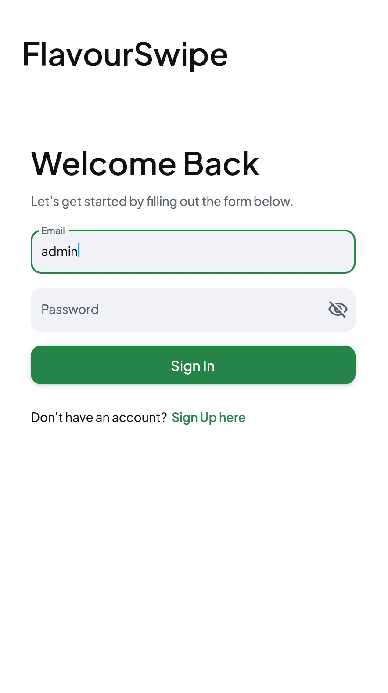
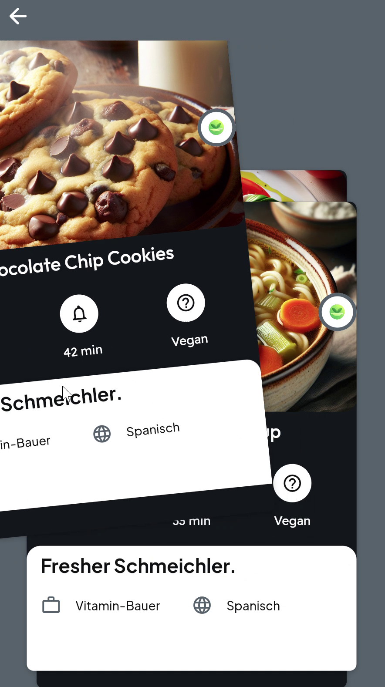
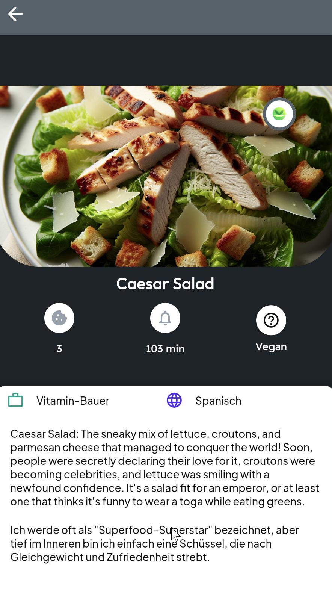
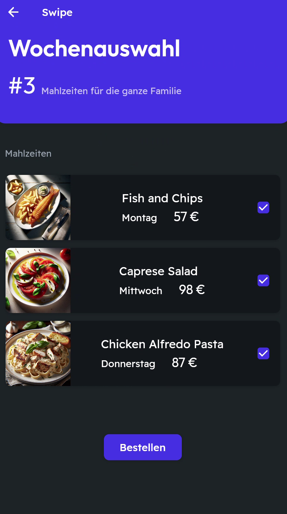
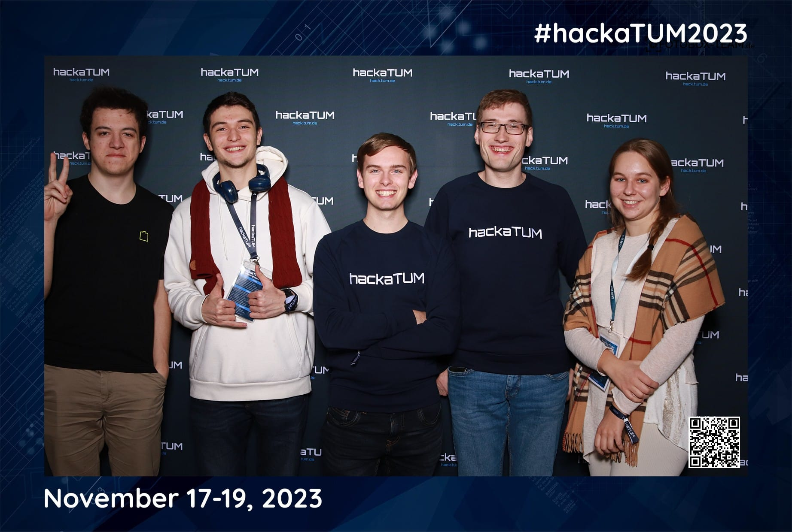

# FlavourSwipe

> Swipe your way to your next meal. A Tinder-style recipe discovery app that
> learns your taste and recommends recipes you will actually want to cook.

[](https://hack.tum.de/)
[](https://www.hellofresh.com/)
[](https://flutter.dev/)
[](https://www.django-rest-framework.org/)
[](https://www.python.org/)
[](LICENSE)

FlavourSwipe was built in 24 hours at **HackaTUM 2023** for the **HelloFresh**
challenge. You swipe right on recipes you like and left on ones you do not; a
content-based recommender learns from those swipes and surfaces new recipes that
match your taste. Recipe imagery is generated on the fly with OpenAI's image API.

## Demo

<p align="center">
  
  
  
  
</p>
<p align="center"><sub>Sign in &middot; swipe through recipes &middot; open a recipe &middot; get a weekly meal plan to order</sub></p>

A full walkthrough is in the [demo video](FlavourSwipe_video.mp4).

## Features

- **Swipe to discover** - browse a curated set of recipes with a familiar
  left/right swipe interaction.
- **Personalised recommendations** - a content-based engine ranks unseen recipes
  by similarity to the ones you liked, and away from the ones you disliked.
- **AI-generated recipe images** - dishes without a photo get one generated from
  their name via the OpenAI image API.
- **REST API** - a clean Django REST backend the Flutter client talks to.

## How it works

```
 Flutter app  ──HTTP/JSON──►  Django REST API  ──►  SQLite
 (swipe UI)                   (recipes, feedback,    (recipes, ingredients,
                               recommender)           user feedback)
                                   │
                                   └─►  OpenAI image API (recipe images)
```

The recommender (`backend/api/recommender.py`) is **content-based**:

1. Each recipe is described by its ingredients (plus its text description).
2. Those descriptions are vectorised with **TF-IDF** and compared with
   **cosine similarity**, giving a recipe-to-recipe similarity matrix.
3. Aggregated user feedback (likes count as +1, dislikes as -1) re-weights the
   scores, so recommendations drift toward what you liked and away from what you
   did not.
4. The API returns the most similar recipes you have not seen yet.

## Tech stack

| Layer | Technology |
|-------|------------|
| Frontend | Flutter (Dart) |
| Backend | Python, Django, Django REST Framework |
| Database | SQLite |
| Recommender | scikit-learn (TF-IDF + cosine similarity), pandas |
| Image generation | OpenAI API |

## Getting started

### 1. Backend (Django API)

```bash
cd backend
pip install -r requirements.txt        # django, djangorestframework, openai, pandas, scikit-learn, requests
python manage.py migrate               # set up the SQLite schema
python manage.py createsuperuser --email admin@example.com --username admin
```

Seed the database with recipes and generate an image for each (needs an OpenAI
API key in your environment):

```bash
export OPENAI_API_KEY=sk-...           # Windows PowerShell: $env:OPENAI_API_KEY="sk-..."
python manage.py create_data ../data/Recipes.csv
```

Run the server:

```bash
python manage.py runserver
```

- Admin:  http://127.0.0.1:8000/admin/
- API:    http://127.0.0.1:8000/api/

### 2. Frontend (Flutter app)

```bash
cd FlavourSwipe
flutter pub get
flutter run                            # pick a connected device or emulator
```

Point the app at your backend URL if it is not running on the default localhost.

## API reference

Base URL: `http://localhost:8000/api`

| Method | Endpoint | Description |
|--------|----------|-------------|
| `GET`  | `/recipe/` | List all recipes |
| `GET`  | `/ingredient/` | List all ingredients |
| `POST` | `/like/<recipeId>/` | Record a like for a recipe |
| `POST` | `/dislike/<recipeId>/` | Record a dislike for a recipe |
| `GET`  | `/recommend/<recipeId>/<excludeRecipeIds>/` | Recommend one similar recipe |
| `GET`  | `/recommendation/` | Get 5 recommended recipes you have not seen |

For `/recommend/`, pass a random `recipeId` on the first call and the current
recipe id thereafter; `excludeRecipeIds` is a comma-separated list of recipe ids
already shown. The response is a similar recipe as JSON.

## Management commands

```bash
python manage.py create_data ../data/Recipes.csv   # import recipes + generate AI images
python manage.py clear_feedback                    # reset all swipe feedback
python manage.py clear_recipes                     # remove all recipes
```

## Project structure

```
backend/            Django project
  api/              recipes, ingredients, feedback models, serializers, views,
                    recommender.py, and management commands (create_data, ...)
  flavourswipe/     Django settings / URLs / WSGI
  manage.py
FlavourSwipe/       Flutter app (lib/, assets/, android/, ios/)
data/Recipes.csv    recipe dataset used to seed the backend
FlavourSwipe_video.mp4   demo recording
```

## Team

<p align="center">
  
</p>

Built at HackaTUM 2023 (November 17-19) by Manuel Kienlein, Ivan Lomakov
([@LivanKov](https://github.com/LivanKov)), Jakob Semmler, and Julia
([@JoulesSpace](https://github.com/JoulesSpace)).

## License

Released under the [MIT License](LICENSE).

## Acknowledgments

- **HelloFresh** for the hackathon challenge.
- **HackaTUM 2023** organisers.
- The open-source Flutter, Django REST Framework, scikit-learn, and pandas
  communities.
